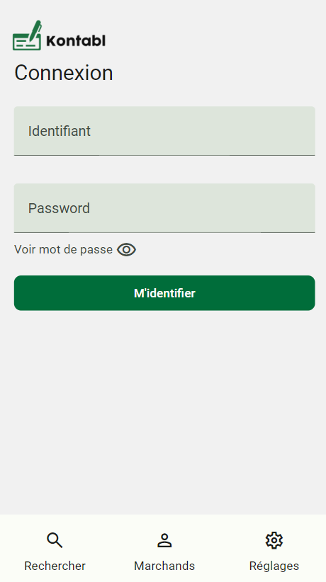
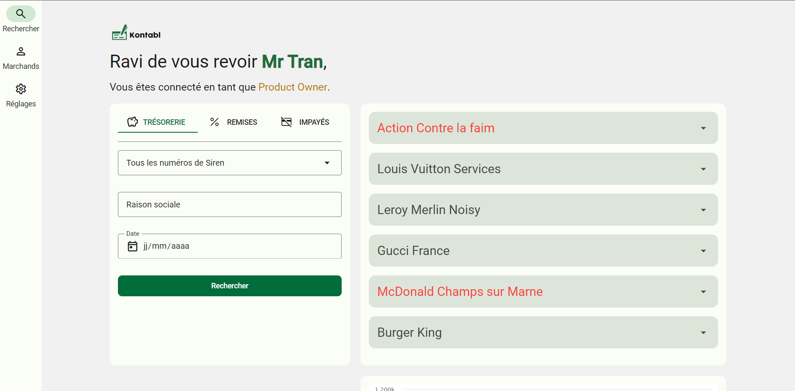
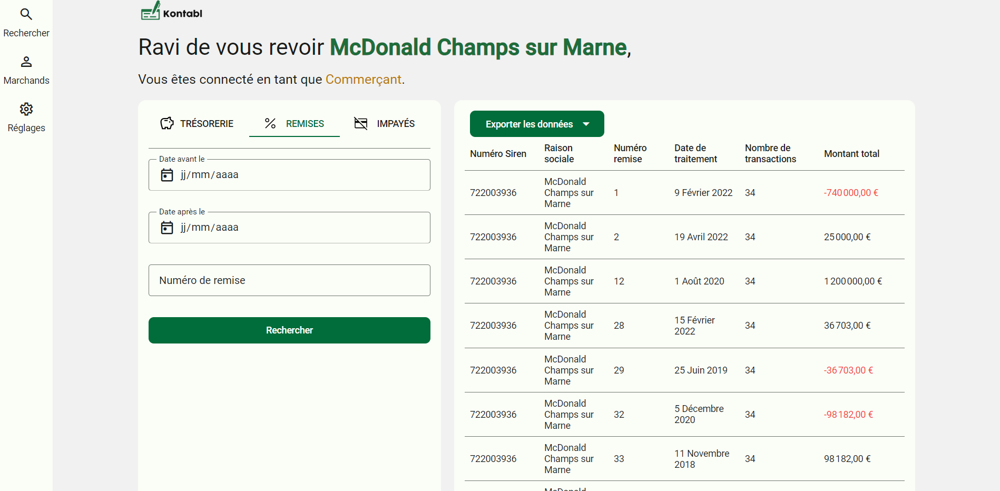
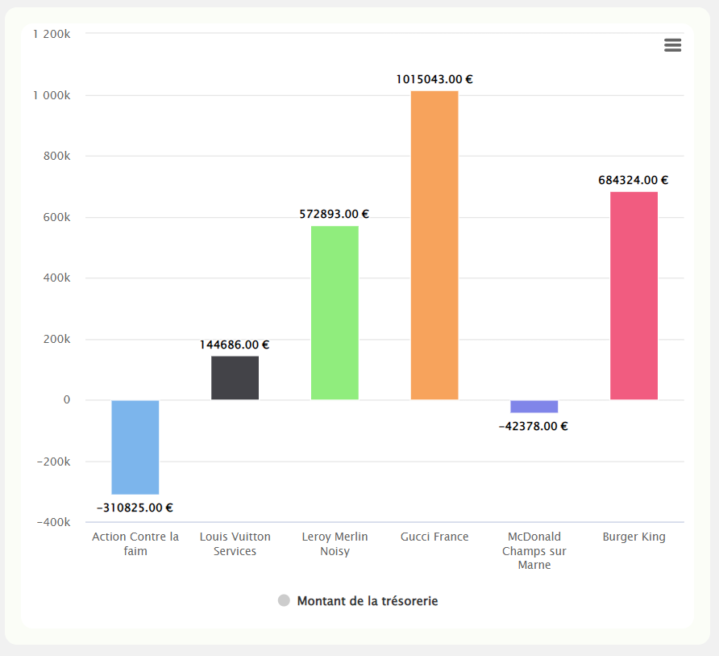

<a href="http://arno.cl/rqau">
    
</a>

Kontabl est un projet universitaire qui a pour objectif final la création d’un portail Web dédié à la consultation des comptes des clients, entreprises ou bien commerçants afin de suivre leurs activités monétiques au quotidien. Voici le lien vers le site : [http://arno.cl/rqau](http://arno.cl/rqau)

<br>
<br>

<table border="0">
    <tr>
        <td>
            
            ____________________________________
        </td>
        <td>
            
            ___________________________________________________________________________________________________________________________________
        </td>
        <td>
            
            ___________________________________________________________________________________________________________________________________
        </td>
        <td>
            
            _______________________________________________________________________
        </td>
    </tr>
</table>

<br>

## Dev

Lancer le serveur en local :
1. Faire le dump de la base de données

2. Renommer le fichier ``.env.example`` en ``.env`` et remplir les champs correspondants à la base de données

3. Lancer le serveur sur Laragon (conseillé) dans un dossier nommé Kontabl

4. (Optionnel) Si vous n'êtes pas sur le domaine ``kontabl.test``, changer la clé du captcha ``sitekey`` dans ``app.js`` par :
```js
window.turnstile.render('.cf-turnstile', {
    sitekey: '0x4AAAAAAABhUS_rVuucp3jB',
    callback: (turnstileToken) => {
```

5. Logins:

Rôle | Login | Mot de passe
--- | --- | ---
Product Owner | ``productowner`` | ``productowner``
Administrateur | ``admin`` | ``admin``
Marchand | ``mcdo``<br> ``louisvi``<br> ``action`` | ``mcdo``<br> ``louisvi``<br> ``action``

## Equipe
[@Berachem](https://github.com/Berachem)
Scrum Master - Développeur Back End et Front End

[@Arnoclr](https://github.com/Arnoclr)
Technical Leader - Développeur Front End

[@CaptainTortue](https://github.com/CaptainTortue) Responsable BDD - Développeur Back End

[@fabrielg](https://github.com/fabrielg)
Développeur Front End

[@Newvall](https://github.com/Newvall)
Développeur Back End - Rédacteur Livrable

[@Cole4rt](https://github.com/Cole4rt)
Développeur Back End - Rédacteur Livrable
